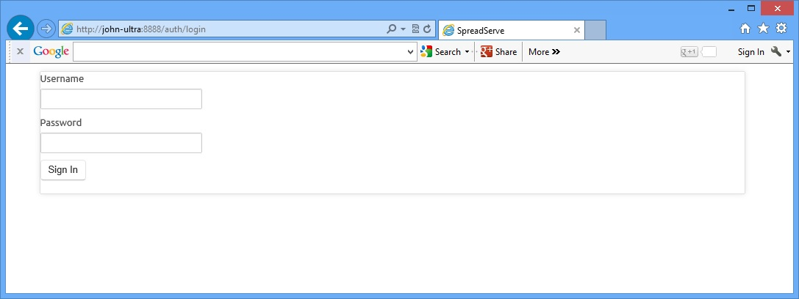
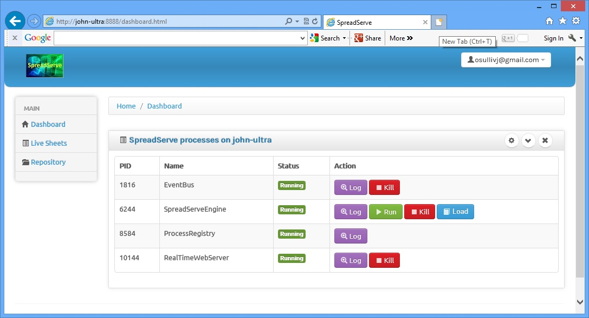
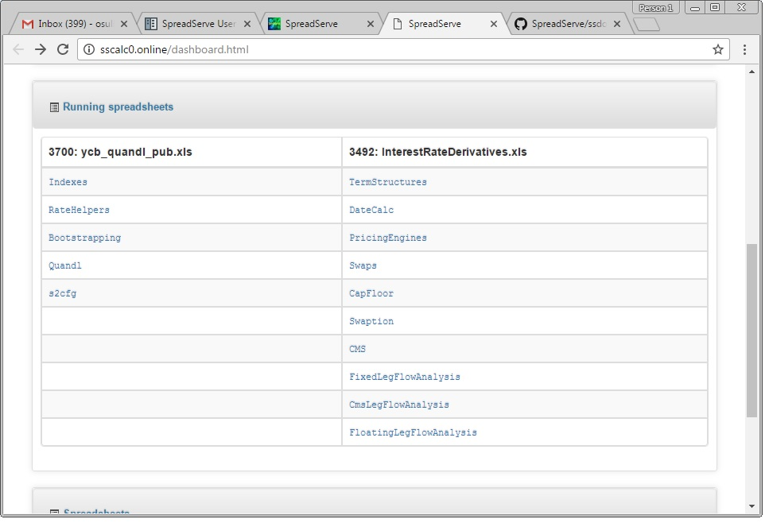
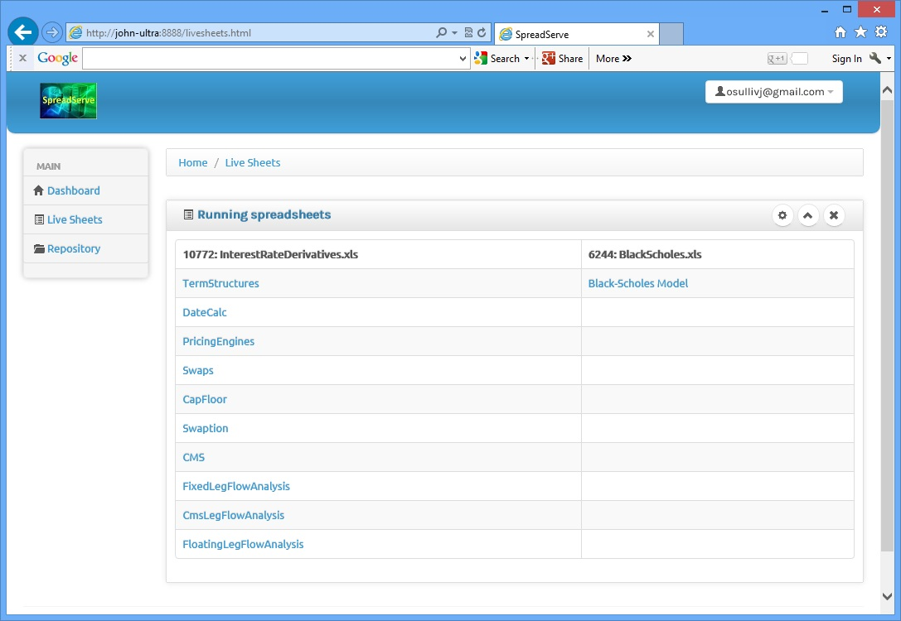
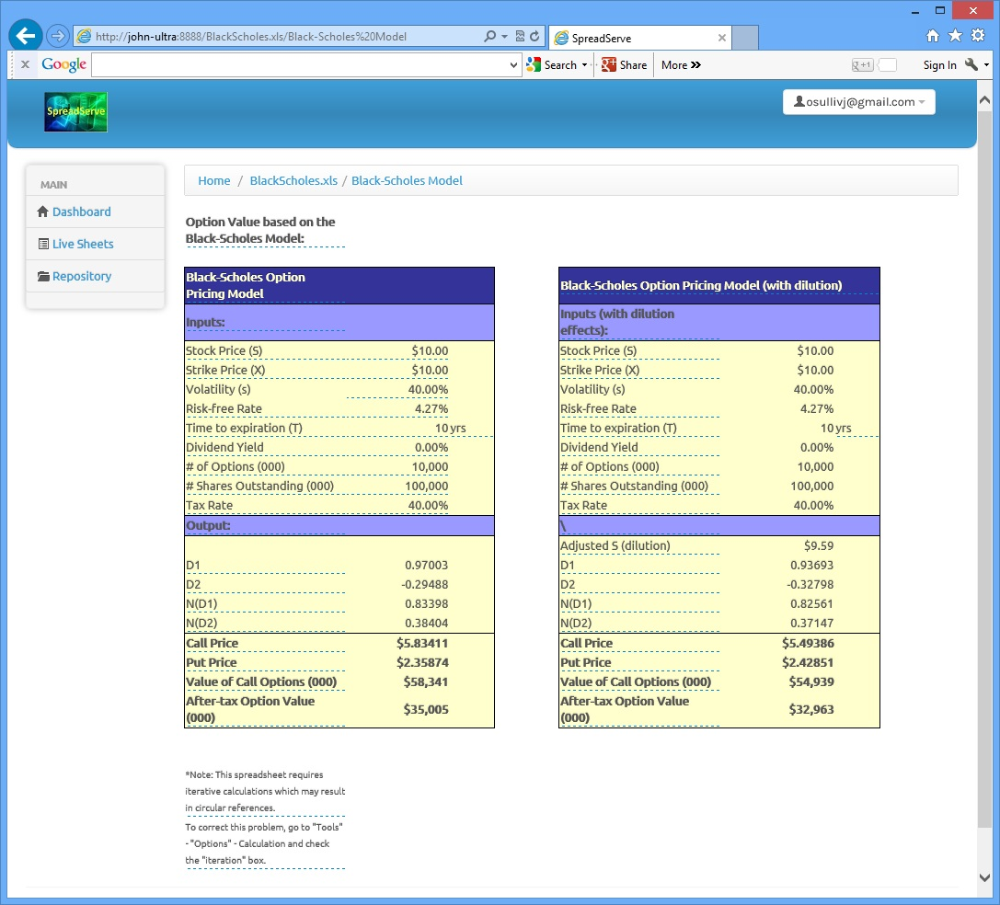
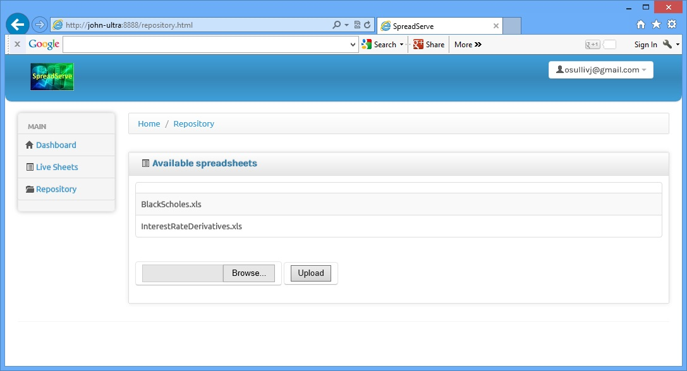
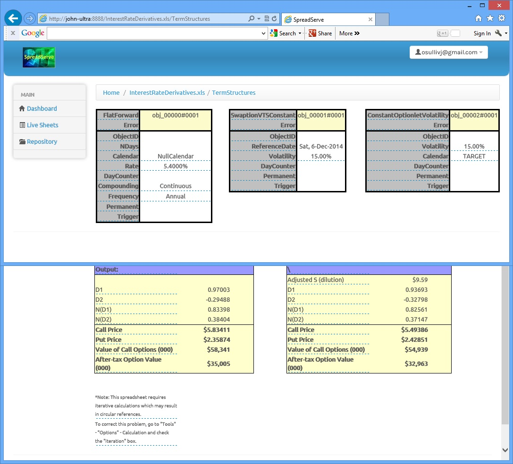
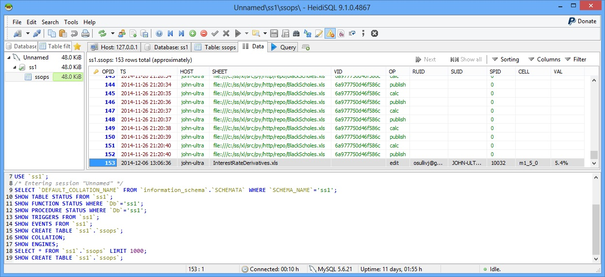

SpreadServer User Guide
=======================

**Starting and stopping SpreadServe**

Once you've installed SpreadServe, you can start and stop it's server processes using a couple of scripts in the sh subdirectory.
Here's how you would start SpreadServe::

    cd c:\SpreadServe\ss0.2.0\sh
    launch SIT baseweb

And here's how you can halt SpreadServe::

    cd c:\SpreadServe\ss0.2.0\sh
    halt SIT
    
The launch script takes two parameters: environment name (SIT), and profile (baseweb). SpreadServe processes use the environment
name to identify each other when they communicate. A SpreadServe deployment used for testing might have an environment name of SIT
or UAT, and one used for hosting production services might be PRD. Environment names allow multiple instances of SpreadServe to
run on the same host. The second parameter, for profile, identifies a file in the the cfg subdirectory. The profile files are in
JSON format, and specify which processes SpreadServe should start when launched; baseweb.jsn specifies a default minimum set of processes.

**Logging in to the web user interface**

When SpreadServe is running, you can point your browser at the SpreadServe RealTimeWebServer and login.

    
Note the port number in the URL: 8888. So if SpreadServe is running on a Windows Server with the hostname sshost, 
the URL you should enter in your browser will be http://sshost:8888  To login you should enter your Windows credentials. 
So in a corporate environment the username will be the same one you use to login to your Windows PC. Outside a corporate 
environment, if you're running SpreadServe on a personal laptop, you'd use the same username and password as you do when
starting Windows itself.

**User Interface: dashboard**

When you've logged in you should see a page like this in your browser...

    
This is the dashboard page. It's used for starting and stopping SpreadServe processes, examining their log files and
loading spreadsheets into running instances of the SpreadServeEngine. You can navigate back to this page at any time
by clicking the dashboard link on the left. The main table in the page gives the process ID of each process, its name,
its status, and a set of buttons for operations. You can use the process ID to lookup the process in Windows Task Manager
if you're logged on to the server hosting SpreadServe.

* Log: clicking this button for any process will show you the current log file for the process. The file will be in the
  %TEMP% directory. The file is displayed 'raw' in the browser, so you'll need to use the back button to return to the dashboard page.
* Kill: in normal operations you should only use this to kill of instances of SpreadServeEngine.
* Run: clicking the Run button next to SpreadServeEngine will create another engine instance.
  You need one instance of the SpreadServeEngine for each spreadsheet you're running.
* Load: instruct a SpreadServeEngine to load a spreadsheet from the repository.
  A dropdown list of all the spreadsheets in the repository will appear, and you can select on for loading.
  Then click on Live Sheets to confirm the spreadsheet has loaded. If the engine was already running a sheet,
  that original sheet will be unloaded before the new one loads up. See below for more detail on Live Sheets
  and the Repository.
* Calc: instruct a SpreadServeEngine to recalculate a sheet. Equivalent to doing shift-ctrl-alt-F9 in Excel.
* RTD: invoke ServerTerminate on any RTD servers that are loaded.

At the top right of the table of processes the middle, down arrow, button will reveal a complete list of 
processes that includes dead or not yet started processes.

**User Interface: Live Sheets**
If you use the SpreadServeEngine Load button to load the Black Scholes.xls spreadsheet, then click on Live Sheets,
you shoud see something like this...

And if you return to the dashboard page and launch a new SpreadServeEngine instance with the Run button, 
and then use the Load button for that new instance to load up InterestRateDerivatives.xls, then this is what you should see...

    
Naturally, all the live sheets within a live spreadsheet are clickable links that will take you through to a view of that sheet.
Try clicking on Black-Scholes Model and you should see this...

This is just what you'd see in Microsoft Excel if you loaded the same SpreadSheet. Try it and see for yourself.
You can find the spreadsheet in the SpreadServe directory tree at py/http/repo/BlackScholes.xls. Now in Excel all
the cells are editable, both those with formulae, and those holding raw data. You can change the cells in and see
the spreadsheet recalc. In the SpreadServe GUI you can change the raw data cells, but you can't edit the formula cells. 
In the SpreadServe GUI try clicking on any of the cells that have the dot dot dot underlining. You'll see a pop up that
will allow you to change the data. If you do, the spreadsheet will recalc and you'll see the changed values in your
browser, just as you would in Excel. But with SpreadServe, there could be any number of browsers looking at that live
sheet, and they'd all see the same data, and the same recalculation.

**User Interface: Repository**
Clicking the Repository link to the left will show you a list of the spreadsheets available for loading with the Load button on the dashboard page...

The repository page also allows you to upload spreadsheets from your local file system. Hit the browse button to select a spreadsheet.
When you've OKed the file selection dialog, hit the Upload button to persist the spreadsheet in the repository directory on the server. 
Next time you hit the load button you're spreadsheet listed.

**Constraints**

* Currently SpreadServe can only handle Excel 97-2003 .xls formatted spreadsheets. Excel 2007 and up .xlsx formatted sheets are on our road map. 
  But for the time being, please use Excel to do a 'Save As' .xls to prepare your spreadsheets for uploading to SpreadServe.
* Limited VBA support. SpreadServe does not support XLAMs. Only embedded VBA can be used. Range can't be used as parameter type. Parameters
  should be built in types only: ints, floats, strings.
* Processes run with elevated permissions access the registry differently, which can prevent `Excel-DNA <https://github.com/Excel-DNA>`_
  based addins from working. Elevated permissions are required to run binaries installed under
  ``c:\Program Files``. However, processes with elevated permissions can't access per user settings
  under ``HKEY_CURRENT_USER``, instead they'll go to ``HKEY_LOCAL_MACHINE``. This is by design to prevent
  exploits. Excel-DNA puts its auto registry entries under ``HKEY_CURRENT_USER`` for RTD registration.
  See `ExcelRtd.cs <https://github.com/Excel-DNA/ExcelDna/blob/master/Source/ExcelDna.Integration/ExcelRtd.cs>`_.
  Consequently, to use addins with Excel-DNA based RTD servers, we must install SpreadServe outside ``c:\Program Files``,
  so we can run it without elevated privileges.
  http://stackoverflow.com/questions/5649544/component-creation-fails-under-uac-admin-works-without-uac-elevation
  https://msdn.microsoft.com/en-us/library/bb756926.aspx
* In a fully automated server environment one can't replicate the human driver of a spreadsheet. For instance
  an user will give a sheet time to complete a long calc, then if they see #VALUE or #NUM, may hit F9 again.
  That use pattern can occur in sheets with hidden dependencies that are not on the graph, eg YieldCurveBootstrapping
  and the Rate/Date column references to an object ID that doesn't change on a calc driven only by changed inputs.
  A complete recalculation of all nodes on the graph, irrespective of changed inputs, is necessary to force the
  changes through. But if a sheet is indirectly circular because it's doing quandl queries and notifying results via RTD,
  a complete recalc on every RTD update causes never ending computation. We have a configuration setting in sseng.ini to
  control what kind of recalculation is done on an RTD update: ``RTD_FULL_CALC``. You should only set this when there are no
  circular dependencies, hidden or otherwise.

**Connectors: getting data in and out of SpreadServeEngines**

Earlier we saw how to start and stop SpreadServe, load a spreadsheet into a SpreadServeEngine, and view the spreadsheet in a
browser. We also saw how we can edit the sheet inputs from a browser, prompting the sheet to recalculate, and then see the
results display in every browser looking at that live sheet. Recall also, that SpreadServe is about bringing resilience, 
automation and scalability to spreadsheets. Resilience comes from being in a monitored and managed server environment. 
Scalability comes from the ability to spin up as many SpreadServe engines as you need, and to have many browsers viewing 
the same sheet. So where does automation come into the picture? The answer to that question leads us to SpreadServe's 
input and output connectivity. As we saw, SpreadServe can take input from web pages, and it can display loaded sheets 
in a browser. SpreadServe can also connect to databases and messaging systems for input and output. Two sample connectors 
are supplied with SpreadServe: BlackScholesMockMarketData and dblog.

**BlackScholesMockMarketData**

One of the sample connector programs supplied with SpreadServe injects mock market data into the Black Scholes spreadsheet.
You can run BlackScholesMockMarketData like this::

    cd c:\SpreadServe\ss0.2.0\py\smpl
    ..\..\sh\sspy black_scholes_mock_mkt_data.py -ENV SIT
    
Note that you may need to change the path and environment name to match your install. Once BlackScholesMockMarketData is running,
take a look at the BlackScholes.xls sheet in Live Sheets. You'll see the stock price ticking up and down, and the whole sheet
recalculating. This sample is designed to illustrate an investment banking use case: how a pricing sheet developed by a trader
can be taken off the desktop, automated, and shared with many colleagues. A real implementation would have a far more complex
spreadsheet, and take its data from a real time market data system.

**dblog**

dblog consists of two processes; one coded in Java, for JDBC DB connectivity, and one in Python, built on SpreadServe's SocketServer
implementation. Here's how you launch the Python SocketServer part of dblog::

    cd c:\SpreadServe\ss0.2.0\py\sock
    ..\..\sh\sspy dblog.py -ENV SIT
    
And this is how you launch the Java process::

    cd c:\SpreadServe\ss0.2.0\sh
    dbconn
    
There are several configuration dependencies here, and this will only work out of the box if you have a MySQL install on your SpreadServe host.
We'll detail the config below. Assuming your config is correct you'll see operations tracked in the database. Try loading the InterestRateDerivates.xls
spreadsheet, navigate to the TermStructures sheet, and change the Rate cell from 4.4% to 5.4%.

    
Obviously the dependent sheets and cells will recalc. Look at the NPV on the Swaps sheet for instance. You'll also find that the SSOPS table in
the database has recorded the change to the sheet too. At SpreadServe we like the HeidiSQL DB clients. Here's how it looks to us...

 
Notice how that last row in the SSOPS table records the timestamp, the spreadsheet, the operation (edit), the user ID, and the cell that was changed
(m1_5_0) and the new value (5.4%).

**dblog configuration**

The configuration for the dblog Python SocketServer process is in ``cfg\dbcfg.py``, and the Java process gets its config from cfg\dbconn.props. The Python
variables in dbcfg.py should match your DB schema, and in dbconn.props the connection details must match your JDBC driver and DB connection. If you're
not using MySQL, you'll need to add the relevant JDBC driver to the lib directory, and fix the CLASSPATH setting in sh\dbconn.cmd to pick up the jar.

**XLL configuration**

To add an XLL to your SpreadServe deployment you need to edit cfg\xll.txt. In the standard install it looks like this::

    file:///c:/SpreadServe/ss0.2.0/bin/xlcall32.dll
    file:///c:/SpreadServe/ss0.2.0/bin/quantlibxl-vc110-mt-s-1_4_0.xll

To add your XLL, copy it to the bin directory, then add another line to xll.txt modelled on the the lines that reference xlcall32.dll and the QuantLib XLL.
