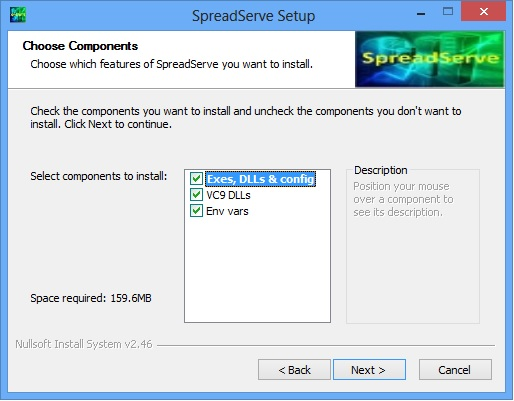

The SpreadServe Installer
=========================

SpreadServe is packaged as an NSIS installer. The install process is designed to make both installation and
repackaging simple and modular, and to minimise system wide host impact.

**Installing SpreadServe for the first time**

* Download the installer from our download page to your target Windows host.
* Launch the ss_install_0.2.0.exe installer by double clicking, or running it at the command line.
* Check the license terms and click "I Agree".
* Choose your install options

  * Exes, DLLs & config: this will copy all the SpreadServe files into ``c:\SpreadServe``. You can 
    change the install directory later in the process.
  * VC9 DLLs: this will install Microsoft's Visual C++ 9 DLLs.
    You must do this the first time you install SpreadServe if you do not already have the VC9 CRT DLLs installed.
    If you do already have them this option will still be harmless.
  * Env vars: this will set two system wide environment variables; ``SSROOT`` and ``SSROOTX``.
    You should do this the first time you install SpreadServe, unless you want to set the variables yourself,
    perhaps as user variables rather than system wide.

* Click Close when the Installer finishes.
* Open a new command shell, cd to ``c:\SpreadServe\ss0.2.0\sh``
* ``launch SIT demoweb``
* Point your browser at http://localhost:8888 to see the web UI home page.
  You may need to enter your Windows user ID and password if you're not authenticated.

**Uninstalling SpreadServe**

* Delete the ``c:\SpreadServe\ss0.2.0`` directory tree
* Go to Control Panel/System/Advanced System Settings/Environment Variables and delete the SSROOT and SSROOTX variables from System variables.
* That's it! SpreadServe does not touch the Windows Registry.

**Directories and environment variables**

By default SpreadServe installs in ``c:\SpreadServe\ss0.2.0``. You can change this in the install process, but below we assume you've taken the default.
Where relative directories are mentioned, without the full path name, they are relative to the ``SSROOT`` environment variable which SpreadServe requires 
to be set to the root of it's install. If you selected the 'Env vars' option in the install you won't need to set the environment variables yourself. 
If not, you can set them in a command shell like so::

    set SSROOT=c:\SpreadServe\ss0.2.0
    set SSROOTX=c:/SpreadServe/ss0.2.0
    
``SSROOTX`` is the same as ``SSROOT``, but with backslashes translated to forward slashes, and any spaces rendered as %20.

**Repackaging SpreadServe**

SpreadServe's install process has been designed for repackaging in corporate deployment systems. The first install option, 
for Exes, DLLs & config, will create a SpreadServe directory tree and nothing more. It does not touch the registry, and 
does not install any DLLs under ``c:\Windows``. The SpreadServe directory tree can be zipped up and unzipped on other hosts. 
SpreadServe doesn't care which directory it lives in; it determines that at run time from the SSROOT and SSROOTX environment 
variables. The second and third install options, for VC9 DLLs and environment variables can be omitted on subsequent installations, 
or in repackingings where alternate mechanisms for environment variables and system DLLs are appropriate.
